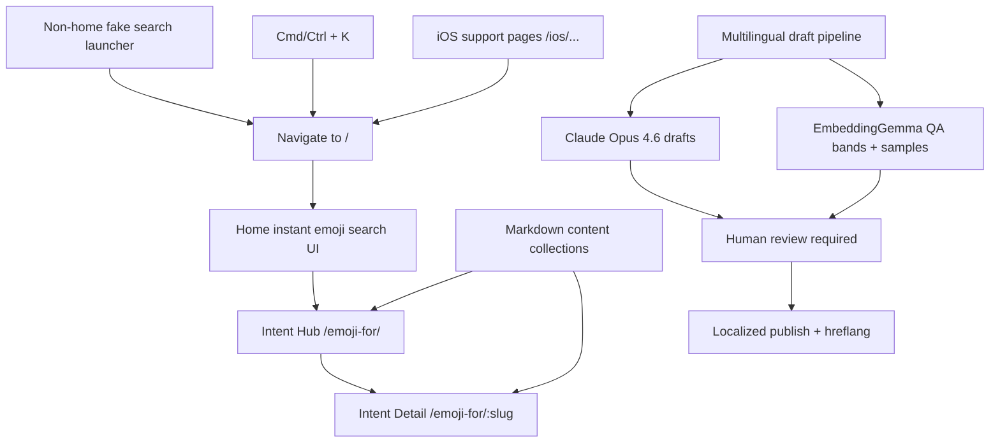

# FetchMoji SEO And LLM Discovery Rollout Plan And Task List

Date: 2026-03-30

## Original Prompt

> I've been thinking about a strategy to grow this with using technical SEO,
> content marketing SEO stuff, research, about, like basically just my idea was
> listing out the common emojis that don't work on the Apple emoji keyboard,
> and then capturing search content from those. Research how viable that is,
> and if there's better ideas or revisions on that idea, and then research how
> LLM search affects that, and any ways to optimize for LLM discovery that play
> nice with Google.
>
> Build a plan and json task list for this

## Goal

Ship the first durable SEO and LLM-discovery surface for FetchMoji by adding:

- crawlable intent pages for high-value phrase searches
- a smaller iPhone troubleshooting cluster
- the home page's instant emoji search as a site-wide surface that can be
  opened from every published page, including `CMD+K` on desktop
- technical SEO foundations needed for indexing and citation
- multilingual draft-generation and QA tooling for locale expansion
- measurement hooks to judge whether the content model should expand

## Non-Goals

- Mass-generating hundreds of thin `emoji for X` pages
- Indexing arbitrary on-site search result URLs
- Leading with generic blog content or trend posts
- Treating `llms.txt` as a primary launch dependency
- Building a full analytics or CMS platform before the first content batch
- Auto-publishing machine-generated locale pages or support pages without human
  review

## Repo Findings

- The app is an Astro 5 static site with a single public route today:
  `src/pages/index.astro`.
- `src/pages/index.astro` mounts the full instant-search app only on the home
  page via `Root client:load`; content routes do not yet share that search
  surface.
- `src/layouts/Layout.astro` hard-codes site-wide title/description metadata
  and currently has no page-level canonical or robots controls.
- `public/_headers` exists for static hosting behavior, but there is no
  `robots.txt`, sitemap, or obvious Search Console setup artifact in the repo.
- `README.md` already calls out `CMD+K launcher & / to focus search` in the
  roadmap, so the desired global search behavior is already consistent with the
  product direction.
- `src/components/Sheet.tsx` and `src/components/ui/dialog.tsx` already exist,
  which gives the repo reusable primitives for a cross-route search launcher.
- `src/data/emojiIntents.ts` already provides:
  - a shared query catalog
  - relevant emoji mappings
  - route and title helpers for future intent pages
  - flags for experiment and corpus seeding
- the shared intent catalog is still English-only today:
  - it has `query` and optional `altQueries`
  - it has no locale-aware aliases or translation-draft fields yet
- `src/data/emojiIntents.test.ts` already asserts uniqueness and explicitly
  frames these as "future pages".
- `src/utils/emojiSearchDocs.ts` already injects the shared intent catalog into
  the search corpus, so content and ranking can share one vocabulary backbone.
- `src/utils/emojiSearchDocs.test.ts` now verifies that research-backed bridge
  and social phrases such as `awkward`, `silence`, `magnifying glass`,
  `respectfully`, `condolences`, `manifesting`, `brain rot`, and
  `overthinking` are seeded into the SQLite-side corpus.
- `scripts/run-emoji-experiments.ts` already consumes the opt-in shared intent
  catalog for manual queries and corpus augmentation, which means the plan does
  not need a separate one-off page-query list.
- `src/components/App.tsx` reads URL params today only for `no_cache`; there is
  no query-prefill path from content pages into the app yet.
- The current embedding runtime is still English-first:
  - `src/constants.ts` sets `DEFAULT_MODEL = 'Xenova/gte-small'`,
    `DEFAULT_DIMENSIONS = 384`, and `DATA_TYPE = 'int8'`
  - `src/utils/hf.ts` / `src/utils/worker.ts` use Transformers.js
    `feature-extraction` with mean pooling and normalized output
  - because `deviceType()` only enables `webgpu` for `fp32`, `fp16`, or
    `q4f16`, the browser path currently falls back to WASM rather than WebGPU
- The repo now has a lightweight health stack through `pnpm audit:health`,
  backed by `scripts/run-site-audits.mjs`, `lighthouserc.json`, and
  `.github/workflows/site-health.yml`.
- `docs/verification/site-health-baseline-2026-03-30.md` shows a strong current
  homepage baseline, with CLS as the main warning to keep visible while content
  pages are added.
- There is no existing combined plan/task-file convention to extend, so this
  file acts as both rollout plan and task tracker.

## External Research

Primary rationale is captured in:

- `docs/research/fetchmoji-seo-llm-discovery-2026-03-30.md`
- `docs/research/ios-emoji-keyboard-friction-and-vocabulary-gaps-2026-03-29.md`
- `docs/research/trending-term-sources-and-multilingual-emoji-search-2026-03-30.md`
- `docs/research/fetchmoji-competitor-audit-and-site-health-tooling-2026-03-30.md`
- `docs/research/llm-assisted-editorial-content-and-multilingual-guardrails-2026-03-30.md`
- `docs/research/global-search-url-locales-and-editorial-qc-tooling-2026-03-30.md`

Key takeaways that materially change implementation:

- The strongest wedge is phrase-level intent pages, not a broad "Apple keyboard
  missing emoji" taxonomy.
- Google explicitly warns against scaled low-value content, including AI-heavy
  page generation without added value.
- Important content should be available in server-rendered HTML; this matters
  even more for AI crawlers than for Googlebot.
- LLM discovery should be treated as a supplement to Google SEO, not a
  replacement channel.
- Competitor long-tail pages are weak on metadata, accessibility, and durable
  internal-link structure, which makes a smaller but technically cleaner launch
  strategically stronger than a broader thin-content launch.
- `Lighthouse + pa11y + linkinator` is enough as the blocking site-health stack
  for this rollout; deeper competitor crawls can stay out of the per-commit path.
- Trend vocabulary should come from official sources that already observe search
  or entity demand, with Tenor as the strongest phrase-level source, GIPHY as a
  useful expansion/validation source, and TMDb plus Wikimedia as better fits
  for entity trends.
- Google is permissive about AI assistance but explicitly hostile to scaled,
  paraphrased, translated, or templated content with little original value.
- Localized pages should be treated as real locale pages with separate URLs and
  `hreflang`, not as lightly adapted wrappers around English content.
- Global search entrypoints should route to `/` without prefilled queries, while
  preserving slash-first indexable routes for editorial pages.
- If query URLs are introduced later, `?q=` is the least-surprising contract,
  but arbitrary search-result URLs should remain non-indexable by default.
- Locale wave 1 should prioritize `pt-BR`, `ja-JP`, and `hi-IN`, with a strict
  human-review requirement before publishing localized pages.
- A multi-tool editorial lint pass (Vale, textlint, proselint, alex, grammar
  check) improves signal quality and helps remove generic LLM writing patterns.
- EmbeddingGemma is a strong fit for offline multilingual QA and duplicate
  detection, while Claude Code with a pinned Opus 4.6 model name is a
  reasonable draft-generation layer.
- Trend aliases and evergreen intent aliases have different lifecycles and
  should not be stored as one flat keyword list.
- Multilingual support splits into:
  - locale-aware aliases and editorial copy, which can be added without a model
    migration
  - multilingual semantic retrieval, which is a separate experiment and should
    not block the first SEO rollout

## Decision

### Content Model

Use the existing `emojiIntents` catalog as the vocabulary backbone, but do not
turn `src/data/emojiIntents.ts` into the full editorial source of truth.

Recommended shape:

- Keep query-to-emoji mapping and experiment flags in `src/data/emojiIntents.ts`
- Add a separate editorial content layer for published pages using Astro content
  collections with Markdown entries
- Key that layer by intent id or slug so pages and search continue to share the
  same taxonomy

Reasoning:

- `emojiIntents` already serves ranking and experiment needs
- published SEO pages need richer prose, related links, CTA copy, and possibly
  support disclaimers that should not bloat search-core data structures

### Global Search Surface

Treat the home page instant-search UI as the single global search destination.

Recommended shape:

- Add a fake search launcher on every non-home page that routes to `/`
- Support `CMD+K` on desktop and an equivalent visible trigger on touch-first
  devices
- Do not prefill query state from content pages in v1
- Keep raw search query URLs out of the indexed surface unless they are
  deliberate named landing pages

Reasoning:

- the home page experience is already the product's strongest interaction
- one destination (`/`) is simpler to keep high quality than multi-route
  launcher state
- this keeps keyboard and click entrypoints consistent without adding query-sync
  edge cases
- the repo roadmap already anticipated a launcher-based search pattern

### Search URL Policy

Use slash paths for all indexable editorial pages and reserve parameterized
search URLs for non-indexed internal search state.

Recommended shape:

- Indexable routes: `/`, `/emoji-for/`, `/emoji-for/<slug>`, `/ios/<slug>`
- Optional internal search URL contract (if added later): `/search?q=<query>`
  (deferred until after pilot launch review)
- Keep arbitrary query URLs out of sitemaps and out of indexable canonicals

Reasoning:

- Google guidance on faceted/query URLs emphasizes crawl discipline and avoiding
  low-value parameter permutations
- `q` is the standard query parameter in Google search interfaces, so it is the
  most familiar future query key if needed

### Trend, Locale, Multilingual, And Model Strategy

Use three layers instead of one overloaded vocabulary file:

- evergreen shared intent data in `src/data/emojiIntents.ts`
- editorial page content keyed to the shared intent taxonomy
- a later trend-alias layer with source and expiry metadata

Recommended shape:

- Keep durable phrase-to-emoji mappings, related emoji, and experiment flags in
  the shared intent catalog
- Add locale-aware aliases in the editorial/content layer first, so dedicated
  pages can support localized copy and exact query coverage without forcing a
  model change
- Add an unpublished multilingual draft layer generated from reviewed English
  source content, with provenance and review status captured separately from the
  live page schema
- Treat trend terms as source-tagged, time-bound aliases with fields like
  `source`, `locale`, `observedAt`, and `expiresAt`
- Do not seed every trending term directly into the embedded corpus; use trend
  aliases first for pages, suggestions, internal linking, and later experiments

Multilingual recommendation:

- Keep `Xenova/gte-small` as the default live search model for the pilot rollout
- Prioritize locale wave 1 as:
  - `pt-BR` (Brazil)
  - `ja-JP` (Japan)
  - `hi-IN` (India), with `en-IN` fallback copy where localization confidence is
    low
- Add a build-time multilingual draft script that:
  - uses Claude Code with pinned `claude-opus-4-6` for draft generation
  - uses EmbeddingGemma for similarity QA and duplicate detection
  - emits high/medium/low QA bands and sample sets for reviewer triage
  - uses default thresholds `low=0.55`, `high=0.80`, `sampleSize=5` unless a
    reviewer explicitly overrides them for a specific run
  - writes reviewable artifacts instead of auto-publishing content
- Defer full multilingual semantic search to a post-pilot prototype
- If the prototype is justified, the strongest candidate is
  `Xenova/multilingual-e5-small`, but that should be treated as a real
  migration requiring:
  - a full corpus rebuild
  - E5-style `query:` / `passage:` formatting
  - threshold retuning and browser performance checks on the current WASM path

Reasoning:

- evergreen page coverage is the launch need
- trend ingestion is useful, but should not destabilize the core corpus or the
  first page set
- multilingual content generation and multilingual semantic retrieval are not
  the same problem
- EmbeddingGemma is better treated as an offline multilingual QA layer first,
  because the official published usage today is stronger for build-time
  validation than for an immediate browser runtime swap in this repo
- multilingual semantic retrieval is valuable, but materially higher-risk than
  adding localized aliases and exact-match coverage

### LLM-Assisted Editorial Guardrails

Use LLMs as accelerators for research, drafting, and localization, not as an
auto-publish path.

Rules:

- Every `/ios/` page requires human review before publish
- Every localized page requires human review before publish
- Run an editorial lint pass on generated copy before human review:
  - `vale`
  - `textlint`
  - `proselint`
  - `alex`
  - grammar check (LanguageTool self-hosted or paid endpoint)
- Generated output must add product-specific value instead of merely
  paraphrasing Apple docs, forum posts, or existing English page text
- Generated locale pages should ship only when the main content is actually
  localized and a real locale URL / `hreflang` strategy exists
- Generated drafts should carry review flags for slang ambiguity, Apple
  terminology risk, and factual uncertainty

Reasoning:

- Google's current documentation is permissive about AI use but explicit about
  scaled low-value paraphrase and translation patterns
- practitioner evidence suggests raw AI summaries are not enough even on strong
  domains
- `/ios/` pages are easy to get subtly wrong if exact Apple terminology or
  device behavior is guessed

### Route Shape

Standardize published content under nested routes:

- `/emoji-for/`
- `/emoji-for/<slug>`
- `/ios/emoji-search-not-working`

Reasoning:

- This matches the research recommendation
- It gives a natural hub path for internal linking
- It is cleaner for future expansion than the current helper's provisional flat
  `/emoji-for-${slug}` format

Implementation note:

- Update the helper and tests in `src/data/emojiIntents.ts` /
  `src/data/emojiIntents.test.ts` as part of the first code stage
- Do not ship both route patterns unless a redirect is intentionally added

### Launch Scope

Do not launch 20-40 pages in the first code pass.

Recommended launch:

- 1 hub page
- 8-10 pilot intent pages
- 3-5 iPhone troubleshooting pages
- site-wide search entry points so every published page can open instant search
- the technical SEO foundation required to index them cleanly
- no launch dependency on automated trend ingestion or a multilingual embedding
  model swap
- no launch dependency on publishing translated locale pages, but do land the
  generator + QA path so locale expansion does not require a new architecture

Expand to the larger 20-40 set only after Search Console and crawl data show
that the pilot model is being indexed and is driving qualified traffic.

### Technical Quality Strategy

Treat technical cleanliness as part of the content strategy, not as a separate
QA concern.

Operational rules for the rollout:

- Each published page should ship with a unique title, useful meta description,
  canonical URL, one clear `h1`, and related-intent internal links.
- Keep primary answer content visible in SSR HTML and avoid client-only answers
  on launch pages.
- Keep `pnpm audit:health` green as content routes are added, or explicitly
  document any temporary scope gaps if the audit still covers only a subset of
  routes.

Reasoning:

- competitor research showed that long-tail emoji pages are unusually weak on
  the exact implementation details FetchMoji can control
- the current local baseline is already stronger than much of the category, so
  maintaining that discipline is part of the product edge

## Rollout Plan

### Stage 1. SEO Foundation And Content Plumbing

Goal:

- make the site capable of serving unique, crawlable pages with proper metadata

Tasks:

- Refactor `src/layouts/Layout.astro` to accept page-specific title,
  description, canonical URL, and optional robots directives
- Add a durable site metadata helper so routes do not duplicate SEO strings
- Decide and implement the final published route shape for intent pages
- Add a global search launcher so content pages can open the same instant
  search surface as the home page
- Support `CMD+K` on desktop plus an equivalent visible trigger on touch-first
  devices
- Make launcher and keyboard entrypoints route to `/` without query prefill

Exit criteria:

- A sample content route can emit unique title, description, canonical, and
  visible HTML copy
- From at least one content route, both launcher click and `CMD+K` open `/`
- Touch-first devices have a visible launcher trigger

### Stage 2. Shared Content Schema And Template

Goal:

- create one reusable content system for intent pages and support pages

Tasks:

- Add the editorial source for published intent pages using Astro content
  collections and Markdown files
- Design the editorial schema so it can later carry locale-aware aliases and
  source-backed trend aliases without changing the search-core taxonomy
- Add fields or companion structures for machine-generated locale drafts,
  provenance, review status, and locale-specific notes
- Build a multilingual draft generator script that uses Claude Code for draft
  generation and EmbeddingGemma for offline semantic QA
- Build a shared page template with:
  - direct answer block
  - recommended emoji list
  - short nuance copy
  - CTA into the app
  - related intents
- Add a hub page template for `/emoji-for/`
- Keep all primary answer text rendered in Astro HTML before hydration

Exit criteria:

- A single template can render multiple pages without fallback to client-only
  content for the main answer
- The schema and scripts can emit at least one reviewable locale artifact

### Stage 3. Pilot Intent Cluster

Goal:

- publish the first useful set of intent pages aligned to research and current
  autocomplete demand

Suggested first batch:

- `awkward`
- `awkward silence`
- `cringe`
- `yikes`
- `proud of you`
- `overthinking`
- `secondhand embarrassment`
- `delulu`
- `my bad`
- `thinking of you`

Tasks:

- Add only the missing evergreen intent entries needed for the pilot batch
- Create editorial copy for each page
- Link pages to adjacent intents and back to the hub
- Ensure pages answer the query without requiring the user to interact with the
  app first
- Record trend/entity aliases for later expansion separately instead of
  promoting trend terms into launch pages by default

Exit criteria:

- Pilot pages build statically and each has distinct copy, metadata, and
  related-link structure

### Stage 4. Support Cluster And Trust Pages

Goal:

- capture support-style demand without turning the site into a generic iPhone
  help blog

Tasks:

- Add 3-5 iOS troubleshooting pages focused on emoji-search failure states
- Add an About / methodology page that explains how recommendations are chosen
- Keep support pages short, corrective, and conversion-oriented
- Treat LLM output as draft-only for support pages and verify exact Apple terms
  before publish
- Link support pages into intent pages and the live app

Suggested support topics:

- `iphone emoji search not working`
- `ios emoji search not working`
- `apple emoji search not working`
- `emoji search only shows genmoji`

Exit criteria:

- Support pages solve the problem briefly and route users toward FetchMoji's
  differentiated experience instead of duplicating broad Apple support content

### Stage 5. Indexing Assets, Validation, And Launch Review

Goal:

- make the content discoverable and leave a clean handoff for measurement

Tasks:

- Add `robots.txt`
- Add sitemap generation and include new content routes
- Verify canonical behavior on hub, intent, and support pages
- If any localized pages launch, add `hreflang` and `x-default` coverage with
  fully qualified alternate URLs
- Add a launch checklist for Search Console submission and crawl inspection
- Keep the lightweight health stack green or deliberately expand its route scope
  as launch pages are introduced
- Capture a short verification note after build and manual page inspection

Exit criteria:

- All launch routes are in the sitemap
- Robots and canonical behavior are intentional
- Build output confirms the answer content is present in HTML

## Task List

Tracking note:

- This section replaces the former standalone JSON task list so strategy and
  execution live in one artifact.

### `seo_01_route_and_metadata_contract`

- Stage: `1`
- Status: `pending`
- Depends on: none
- Write scope: `src/layouts/Layout.astro`, `src/data/emojiIntents.ts`,
  `src/data/emojiIntents.test.ts`, `src/pages/**`
- Deliverable: routes and layout support nested intent pages, unique metadata,
  canonical URLs, and optional robots directives
- Verification: `pnpm test --run src/data/emojiIntents.test.ts`, `pnpm build`,
  inspect built HTML for the home page and one sample intent page
- Stop conditions: one sample content route emits unique title, description,
  canonical, and visible SSR text; only one published route pattern is active
  for intent pages

### `seo_02_global_search_entrypoints`

- Stage: `1`
- Status: `pending`
- Depends on: `seo_01_route_and_metadata_contract`
- Write scope: `src/components/App.tsx`, `src/components/**`,
  `src/layouts/**`, `src/pages/**`, `src/utils/searchConfig.ts`
- Deliverable: every published page exposes a fake search launcher to `/`, and
  desktop users can route to `/` with `CMD+K`
- Verification: `pnpm build`, manual check that content-page launcher click
  routes to `/`, manual check that `CMD+K` routes to `/` from a content page
- Stop conditions: search entry points work without breaking existing `no_cache`
  handling, and touch-first devices have a visible trigger instead of relying on
  keyboard shortcuts alone

### `seo_03_editorial_content_schema`

- Stage: `2`
- Status: `pending`
- Depends on: `seo_01_route_and_metadata_contract`
- Write scope: `src/content/**`, `src/data/emojiIntents.ts`, `src/lib/**`,
  `src/types/**`
- Deliverable: Astro Markdown content collections provide the structured source
  of truth for page copy, related links, CTA text, and future locale or
  trend-alias metadata, keyed to shared intent slugs or ids
- Verification: schema or type validation passes during build; at least one
  content entry resolves cleanly against the shared intent catalog
- Stop conditions: published page copy is separated from core search-ranking
  data; the schema is strict enough to prevent missing required page fields;
  locale-aware aliases and later trend aliases can be added without polluting
  the core search taxonomy

### `seo_03a_multilingual_draft_pipeline`

- Stage: `2`
- Status: `pending`
- Depends on: `seo_03_editorial_content_schema`
- Write scope: `scripts/**`, `src/data/emojiIntents.ts`, `docs/research/**`,
  `docs/plans/**`
- Deliverable: a build-time script can generate locale draft artifacts with
  Claude Code `claude-opus-4-6` and run EmbeddingGemma QA checks for semantic
  drift and duplicate phrasing, including high/medium/low QA sample outputs for
  human triage
- Verification: `bun scripts/generate-multilingual-drafts.ts --dry-run --locales pt-BR,ja-JP,hi-IN --limit 2 --qa-low-threshold 0.55 --qa-high-threshold 0.8 --qa-sample-size 5`;
  if Claude auth and Hugging Face access are available, run one live locale pass
  and inspect the generated artifact
- Stop conditions: there is no auto-publish path; outputs include provenance,
  review flags, and clear failure modes for missing Claude auth or
  EmbeddingGemma prerequisites

### `seo_04_shared_page_template`

- Stage: `2`
- Status: `pending`
- Depends on: `seo_03_editorial_content_schema`,
  `seo_02_global_search_entrypoints`
- Write scope: `src/pages/emoji-for/**`, `src/components/**`,
  `src/layouts/**`, `src/lib/**`
- Deliverable: reusable templates for the intent hub and intent detail pages
  with direct answers, nuance copy, related links, and CTA blocks
- Verification: `pnpm build`, inspect built HTML to confirm the answer block
  renders before hydration
- Stop conditions: primary page content is present in static HTML; templates do
  not require client-side search interaction to answer the query

### `seo_05_expand_shared_intent_catalog`

- Stage: `3`
- Status: `pending`
- Depends on: `seo_03_editorial_content_schema`
- Write scope: `src/data/emojiIntents.ts`, `src/data/emojiIntents.test.ts`,
  `scripts/**`
- Deliverable: the shared intent catalog includes the evergreen pilot SEO
  targets, including gaps like `awkward silence` if selected for launch
- Verification: `pnpm test --run src/data/emojiIntents.test.ts`; any experiment
  or seed scripts referencing intents still pass type/build checks
- Stop conditions: pilot pages do not rely on ad hoc one-off query data outside
  the shared catalog; trend or entity aliases are tracked separately from
  evergreen launch intents

### `seo_06_publish_pilot_intent_pages`

- Stage: `3`
- Status: `pending`
- Depends on: `seo_04_shared_page_template`,
  `seo_05_expand_shared_intent_catalog`
- Write scope: `src/content/**`, `src/pages/emoji-for/**`,
  `src/components/**`
- Deliverable: pilot intent pages exist for the first high-value phrase cluster
  and are interlinked through the hub and related-intent sections
- Verification: `pnpm build`, manual review of at least three pilot pages on
  desktop and mobile
- Stop conditions: each pilot page has distinct copy and metadata; every pilot
  page links to the hub and at least two related intents

### `seo_07_publish_support_and_trust_pages`

- Stage: `4`
- Status: `pending`
- Depends on: `seo_04_shared_page_template`
- Write scope: `src/content/**`, `src/pages/ios/**`, `src/pages/about.astro`,
  `src/components/**`
- Deliverable: a small support cluster captures native-keyboard failure queries
  and an About or methodology page establishes site trust
- Verification: `pnpm build`, manual review that support pages answer the
  problem briefly and route users to intent pages or the app
- Stop conditions: support pages do not drift into generic Apple-help filler;
  the About or methodology page explains how recommendations are chosen; `/ios/`
  pages are reviewed for exact Apple terminology before publish

### `seo_08_add_technical_discovery_assets`

- Stage: `5`
- Status: `pending`
- Depends on: `seo_06_publish_pilot_intent_pages`,
  `seo_07_publish_support_and_trust_pages`
- Write scope: `public/robots.txt`, `src/pages/**/*.xml.ts`,
  `astro.config.mjs`, `src/layouts/Layout.astro`
- Deliverable: crawl and index assets intentionally include the launch routes
  and expose canonical URLs
- Verification: `pnpm build`, inspect generated sitemap, inspect HTML
  canonicals on hub, intent, support, and about pages
- Stop conditions: all launch pages appear in the sitemap; robots and canonical
  behavior match the intended indexability policy

### `seo_09_add_regression_tests_and_verification_note`

- Stage: `5`
- Status: `pending`
- Depends on: `seo_08_add_technical_discovery_assets`
- Write scope: `src/**/*.test.ts`, `src/**/*.test.tsx`, `docs/verification/**`
- Deliverable: the rollout has automated coverage for metadata and route
  behavior plus a short verification artifact for review
- Verification: `pnpm test --run`, `pnpm build`, `pnpm audit:health`
- Stop conditions: metadata and route regressions are covered by tests; a dated
  verification note records what was manually checked

### `seo_10_launch_review_and_scale_decision`

- Stage: `5`
- Status: `pending`
- Depends on: `seo_09_add_regression_tests_and_verification_note`
- Write scope: `docs/progress/**`, `docs/research/**`, `docs/plans/**`
- Deliverable: a follow-up decision is recorded on whether to expand from the
  pilot set to the full 20-40 page backlog
- Verification: Search Console indexing review, crawl-log or hosting-log review
  where available, manual assessment of query/page fit
- Stop conditions: do not expand page count until the pilot shows early
  indexing and qualified discovery

## Validation Gates

### Automated

- `pnpm test --run src/data/emojiIntents.test.ts`
- route/template tests for published pages and metadata helpers
- `pnpm build`
- `pnpm audit:health`
- `bun scripts/generate-multilingual-drafts.ts --dry-run --locales pt-BR,ja-JP,hi-IN --limit 2 --qa-low-threshold 0.55 --qa-high-threshold 0.8 --qa-sample-size 5`

### Manual

- Inspect generated HTML for:
  - canonical tag
  - page-specific title and description
  - visible answer text in SSR HTML
  - internal links to related intents
- Verify content-page launcher click routes to `/`
- Verify `CMD+K` routes to `/` from a content page on desktop and that touch
  devices have a visible search trigger
- Check sitemap output includes hub, pilot intent pages, support pages, and
  about page
- If localized pages ship, verify `hreflang` clusters and ensure the main
  content is actually translated
- Review the latest Lighthouse and pa11y outputs after content-route changes
- Review at least one page on mobile and desktop for readability and repeated
  use quality

### Human Required Review Queue

- [ ] Review every `/ios/*` page for exact Apple terminology and support-claim
  accuracy before publish.
- [ ] Review every locale draft artifact for `pt-BR`, `ja-JP`, and `hi-IN`
  before publish.
- [ ] Manually inspect all `low` QA-band records from EmbeddingGemma output;
  either revise or exclude before publish.
- [ ] Spot-check at least 5 `high` QA-band records per locale to ensure “high
  similarity” still reads naturally and is not literal/awkward.
- [ ] Approve indexability only after editorial lint pass is clean (`vale`,
  `textlint`, `proselint`, `alex`, grammar check) and human review is complete.

### Launch Review Gate

Do not expand beyond the pilot batch until:

- pages are indexed cleanly
- internal links and canonicals behave as expected
- Search Console impressions show at least early discovery on the pilot cluster

## Plan End State

### Mermaid Diagram



### URL Path Tree

```text
/
├── (home instant emoji search; global launcher target)
├── emoji-for/
│   ├── index
│   └── <slug>/
├── ios/
│   └── emoji-search-not-working/
├── about/
└── search/
    └── ?q=<query>  (optional future internal URL; non-indexable by default)
```

## Deliverables

- one consolidated plan/tasks file at
  `docs/plans/fetchmoji-seo-llm-discovery-rollout-2026-03-30.md`
- content-route implementation for hub, pilot intent pages, support pages, and
  about/methodology page
- site-wide instant-search entry points, including a global launcher pattern
- multilingual draft-generation and QA scripts for locale expansion
- technical SEO assets for crawl and index management
- verification note after implementation
- green or intentionally scoped site-health audit coverage for the rollout

## Risks And Open Questions

- Route migration risk:
  moving from `/emoji-for-${slug}` helpers to nested `/emoji-for/<slug>` needs
  a single explicit decision and test update
- Pilot page count:
  8-10 pages is the recommended first batch, but can be reduced to 5 if
  editorial throughput is the actual bottleneck
- Query selection:
  `awkward silence` is a strong candidate from research, but it is not in the
  current shared catalog and must be added deliberately
- Measurement gap:
  there is no current Search Console baseline, so post-launch review is needed
  before scaling content volume
- Search-launcher scope:
  even with the simplified “always route to `/`” model, launcher placement and
  keyboard interception still need manual cross-device checks
- Human-review throughput:
  locale wave quality is now explicitly gated by human review; if reviewer
  capacity drops, locale publish pace should slow instead of auto-publishing
- Health-gate scope:
  the current site-health baseline is homepage-centric, so rollout work may
  need to widen audit coverage if content routes are not yet exercised by the
  health stack
- Trend ingestion scope:
  the plan now has strong source candidates, but there is still no ingestion
  implementation or TTL policy for expiring aliases
- Multilingual scope:
  locale-aware aliases and localized draft artifacts are now in scope, but a
  true multilingual semantic search prototype should still be kept behind a
  separate post-pilot success gate
- Generator prerequisites:
  the multilingual draft pipeline depends on refreshed Claude auth plus
  EmbeddingGemma access and build-time dependencies before it can run live
- Model/runtime tradeoff:
  because the current browser path is WASM `int8`, any multilingual model
  experiment must be validated against actual startup and memory behavior on
  iPhone Safari, not assumed WebGPU performance

## Sources

- `docs/research/fetchmoji-seo-llm-discovery-2026-03-30.md`
- `docs/research/ios-emoji-keyboard-friction-and-vocabulary-gaps-2026-03-29.md`
- `docs/research/trending-term-sources-and-multilingual-emoji-search-2026-03-30.md`
- `docs/research/fetchmoji-competitor-audit-and-site-health-tooling-2026-03-30.md`
- `docs/research/llm-assisted-editorial-content-and-multilingual-guardrails-2026-03-30.md`
- `docs/research/global-search-url-locales-and-editorial-qc-tooling-2026-03-30.md`
- `docs/verification/site-health-baseline-2026-03-30.md`
- `astro.config.mjs`
- `src/layouts/Layout.astro`
- `src/pages/index.astro`
- `src/components/App.tsx`
- `src/data/emojiIntents.ts`
- `src/data/emojiIntents.test.ts`
- `src/utils/emojiSearchDocs.test.ts`
- `src/utils/emojiSearchDocs.ts`
- `src/utils/hf.ts`
- `src/utils/worker.ts`
- `scripts/run-emoji-experiments.ts`
- `scripts/generate-multilingual-drafts.ts`
- `scripts/embeddinggemma_similarity.py`
- `package.json`
